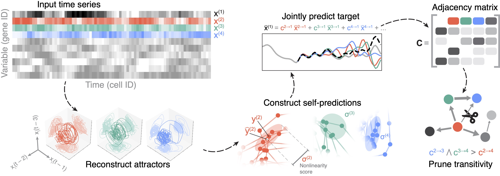

# RiCE

The Riemannian Causal Embedding (RiCE) algorithm discovers causal relationships in high-dimensional time series data.



### Example usage

```python
    from rice import CausalDetection
    from rice.examples import ecoli100

    # Load example time series dataset and ground truth connectivity matrix
    X, adj_true = ecoli100() # shapes (300 timepoints x 100 genes) and (100 genes x 100 genes)

    # Run causal analysis and get predicted causal graph
    model = CausalDetection()
    adj_pred = model.fit_transform(X) # shape (100 genes x 100 genes)
```


### Installation

Install directly from GitHub using PyPI

```bash
    pip install git+https://github.com/williamgilpin/rice
```

Check that everything is installed correctly

```bash
    python -m unittest
```


### Requirements

+ Python 3.7+
+ NumPy
+ Scikit-learn
+ SciPy
+ [umap-learn](https://umap-learn.readthedocs.io/en/latest/)

The examples and tests require additional dependencies:

+ Pytest
+ Scipy
+ Pandas
+ Anndata


### What do we mean by "Causality"?

Our approach aims to discover weak (observational) causality, in the sense of Granger causality but generalized for nonlinear dynamical systems. This form of causality is equivalent a discovering a forcing term in a system of coupled differential equations.

We do not discover strong (interventional) causality, in the sense of Pearl's do-calculus, which is impossible without the ability to intervene on the data generator (the experimental system).
<!-- 
### References -->


